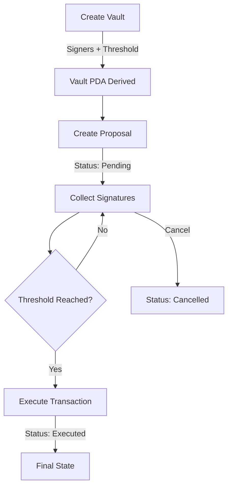

# Solana Multi-sig Vault API

A backend implementation of a multi-signature wallet system for the Solana blockchain. This API allows multiple signers to create a shared vault, propose transactions, and authorize them through individual cryptographic signatures based on a predefined threshold.

## 🏗 Project Structure

The project is organized into modular components handling storage, routing, and Solana-specific logic.

```text
multi-sig/
├── src/
│   ├── controllers/      # Vault and Proposal handlers
│   ├── routes/           # API endpoints (Vault & Proposal sub-routes)
│   ├── utils/            # Solana web3.js and crypto utilities
│   ├── types.ts          # Vault and Proposal interfaces
│   ├── storage.ts        # In-memory data management
│   └── index.ts          # Application entry point
├── tsconfig.json         # TypeScript configuration
└── package.json          # Dependencies
```

## 🔄 Logic & Lifecycle

The Multi-sig system follows a strict state-machine lifecycle for transaction authorization.

### Proposal Lifecycle Flow



### Detailed Logic Explanation
1.  **Vault Derivation**: A Vault is uniquely identified by its signers. The API derives a PDA using the seed `"vault"` and a **SHA256 hash** of the sorted signer public keys.
2.  **Threshold Logic**: Each vault has a `threshold` (e.g., 2-of-3). Proposals remain in "pending" status until the number of valid signatures meets this threshold.
3.  **Signature Verification**: Individual signers must provide an Ed25519 signature of the proposal message. The API verifies each signature against the signer's public key before adding it to the proposal.
4.  **In-memory Storage**: Vaults and proposals are managed in an efficient `Map` structure for high-performance retrieval and updates.

## ✨ Key Features

-   **Deterministic Vaults**: Same signers always result in the same Vault PDA.
-   **Security**: Signature verification for every approval step.
-   **Transaction Proposals**: Flexible message-based proposal system.
-   **Threshold Management**: Customizable M-of-N signing requirements.

## 🛠 Crucial Functions Reference

These functions in `src/utils/solana.ts` are essential for the multi-sig logic:

### `deriveVaultPDA(signers: string[]): { address: string; bump: number }`
Generates a unique vault address based on the participation group.
```typescript
export function deriveVaultPDA(signers: string[]): { address: string; bump: number } {
  const sortedSigners = [...signers].sort();
  const sha256Hash = crypto.createHash("sha256").update(sortedSigners.join(":")).digest();

  const [publicKey, bump] = PublicKey.findProgramAddressSync(
    [Buffer.from("vault"), sha256Hash],
    PROGRAM_ID
  );

  return { address: publicKey.toBase58(), bump };
}
```

### `verifySignature(message: string, signature: string, publicKey: string)`
Verifies that an approval signature is valid for a specific signer.
```typescript
export function verifySignature(message: string, signature: string, publicKey: string): boolean {
  try {
    const messageBytes = Buffer.from(message);
    const signatureBytes = bs58.decode(signature);
    const publicKeyBytes = bs58.decode(publicKey);

    return nacl.sign.detached.verify(messageBytes, signatureBytes, publicKeyBytes);
  } catch (error) {
    return false;
  }
}
```

## 📡 API Endpoints

### Vaults
| Method | Endpoint | Description |
| :--- | :--- | :--- |
| `POST` | `/api/vault/create` | Create a new multi-sig vault |
| `GET` | `/api/vault/:vaultId` | Get vault details by ID |
| `GET` | `/api/vault/:vaultId/data` | Get custom data associated with the vault |

### Proposals (Prefix: `/api/vault/:vaultId`)
| Method | Endpoint | Description |
| :--- | :--- | :--- |
| `POST` | `/propose` | Create a new transaction proposal |
| `GET` | `/proposals` | List all proposals for this vault |
| `GET` | `/proposals/:id` | Get specific proposal details |
| `POST` | `/proposals/:id/approve` | Add a signature to a proposal |
| `POST` | `/proposals/:id/cancel` | Cancel a pending proposal |
